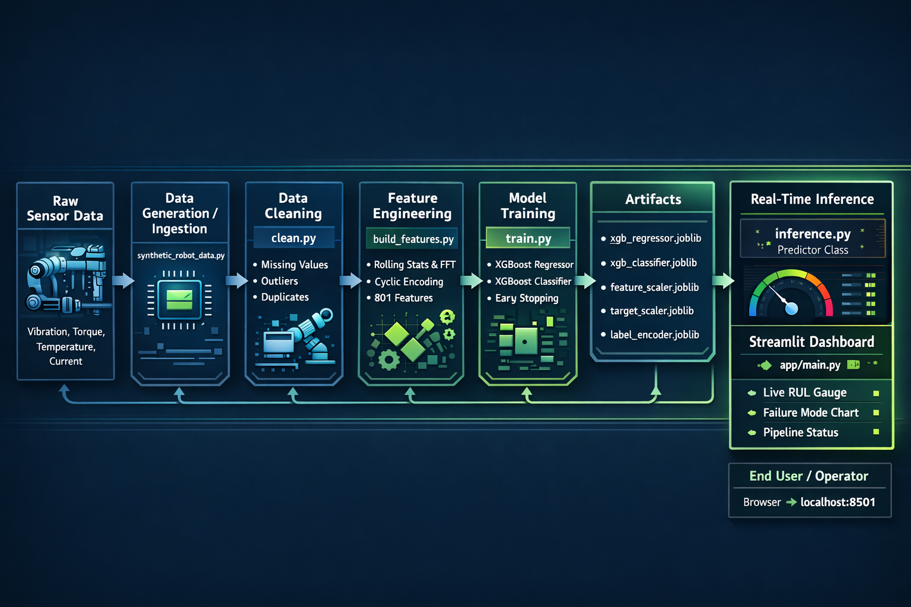

# 🤖 RobotGuard AI: Revolutionizing Predictive Maintenance for Industrial Robots

<p align="center">
  
  <br/>
  <em>Imagine a futuristic robot arm glowing with AI insights – preventing breakdowns before they happen!</em>
</p>

Welcome to **RobotGuard AI** — an **end-to-end machine learning pipeline** that transforms raw sensor telemetry into actionable predictions for **six-axis industrial robots**.

In a high-stakes car manufacturing line with **2,000 robots**, unplanned downtime costs **$80,000 per hour**.  
RobotGuard AI acts like a **super-smart predictive mechanic**, forecasting **Remaining Useful Life (RUL)** in hours and **failure modes** (bearing wear, gear tooth damage, overheating, etc.) — enabling **just-in-time maintenance** and potentially saving **millions annually**.

This project is more than code — it's a **complete ML engineering showcase**: synthetic data generation → cleaning → advanced feature engineering → hybrid modeling → real-time inference → beautiful Streamlit dashboard.

Let's dive in!

---

## Introduction

Robots are the backbone of modern manufacturing — but they fail. Traditional rule-based systems can't handle the complex, multi-modal patterns in vibration, torque, temperature, and current data.

**RobotGuard AI** solves this with:

- **XGBoost regression** → predicts **RUL** (hours until failure)
- **XGBoost classification** → predicts one of **5 failure modes**
- Synthetic data generation (real industrial datasets are rare and expensive)
- 80+ engineered time-series & spectral features
- A dark, futuristic **Streamlit dashboard** with live gauges and probability charts

Built as a **portfolio-grade project**, it demonstrates full-stack ML skills while being production-ready and easily extensible.

### Key Achievements from Development

- Handled **5.3M+ row datasets** on CPU (memory optimized from ~6.8 GB → ~1.5 GB)
- Achieved **R² ≈ 0.71** for RUL prediction on synthetic data
- Overcame class imbalance in failure modes with stratified splitting & class weights
- Containerized with **Docker** + **docker-compose** for easy deployment
- Automated workflow with **Makefile**, **pyproject.toml**, **GitHub Actions CI/CD**, and **Dependabot**

Ready to explore? Let's get started!

---

## Project Overview

RobotGuard AI delivers a complete predictive maintenance pipeline:

1. **Generate** high-fidelity synthetic telemetry (multi-modal degradation cycles)
2. **Clean** raw data (missing values, outliers, duplicates)
3. **Engineer** 80+ features (rolling statistics, FFT spectral features, gradients, cyclic encodings)
4. **Train** hybrid XGBoost models:
   - Regression: Remaining Useful Life (hours)
   - Classification: Failure mode (bearing wear, gear tooth, overheat, etc.)
5. **Infer** real-time predictions from raw sensor inputs
6. **Visualize** everything in a **dark, futuristic Streamlit dashboard**

**Business Story Example**  
In a car manufacturing plant, RobotGuard detects early **bearing wear** 24 hours before failure — saving **$1.92M** in downtime costs. That's the power of proactive AI.

**Highlights**
- Scales from 500K to 10M+ rows on CPU
- Time-series safe (no leakage, strict temporal splits)
- Memory-efficient (downcasting, selective column loading)
- Beautiful UI with Plotly gauges, progress animations & status badges

---

## Project Structure

Clean, modular, and follows ML best practices.

```text
industrial-robot-predictive-mtce/
├── app/                    # Streamlit dashboard
│   ├── main.py             # Core app logic & routing
│   └── style.css           # Futuristic dark theme
├── config/                 # Configuration
│   └── config.yaml         # Pipeline parameters (windows, paths, etc.)
├── data/                   # Data lifecycle (gitignored)
│   ├── 01_raw/             # Synthetic raw telemetry
│   ├── 02_intermediate/    # Cleaned data
│   └── 03_features/        # Engineered features
├── models/                 # Trained artifacts (gitignored)
├── src/                    # Source code
│   ├── etl/                # Data ingestion & preparation
│   │   ├── synthetic_data_generator.py   # Synthetic data creation
│   │   └── clean.py        # Cleaning pipeline
│   ├── features/           # Feature engineering
│   │   └── build_features.py
│   ├── modeling/           # Model training & inference
│   │   ├── train.py        # XGBoost training
│   │   └── inference.py    # Real-time predictor class
│   └── utils/              # Shared helpers
│       └── helpers.py
├── tests/                  # (add your unit tests here)
├── .dockerignore
├── .gitignore
├── docker-compose.yml
├── Dockerfile
├── Makefile
├── pyproject.toml
├── README.md
└── requirements.txt
```


## System Architecture


<p align="center">
  
  <br/>
  <strong>Complete ML Pipeline Flow</strong><br/>
  Raw telemetry → Cleaning → 80+ Features → XGBoost Models → Real-time Predictions → Futuristic Dashboard
</p>


## 🛠 Tech Stack & Key ML Concepts

RobotGuard AI is built with a modern, efficient, and production-ready stack.  
Think of it as the **complete toolkit** for a next-gen predictive maintenance system.

### Core Language & Runtime
- **Python 3.10+**  
  Fast, readable, and the perfect foundation for ML engineering.

### User Interface & Visualization
- **Streamlit** + **Plotly**  
  Powers the dark, futuristic dashboard with real-time gauges, probability bars, and smooth animations.

### Data Processing & Storage
- **Pandas** + **NumPy** + **PyArrow**  
  Lightning-fast data wrangling, memory-efficient Parquet handling, and massive dataset support.

### Feature Engineering
- **SciPy** (signal processing) + **Custom rolling logic**  
  Extracts 80+ powerful features: time-domain stats (mean/std/min/max), FFT spectral analysis (RMS, peak frequency, entropy), gradients, and cyclic encodings.

### Modeling & Learning
- **XGBoost** (both regression & multi-class classification)  
  High-performance gradient boosting with early stopping, class weighting, and tuned hyperparameters for robust RUL and failure mode prediction.

### Preprocessing & Utilities
- **scikit-learn**  
  Reliable scaling (`StandardScaler`), encoding (`LabelEncoder`), and evaluation metrics.

### Deployment & Automation
- **Docker** + **docker-compose**  
  Containerized, portable, and ready for local or cloud deployment.
- **Makefile**  
  One-command magic: `make all`, `make train`, `make docker-up`, etc.
- **GitHub Actions** + **Dependabot**  
  Automated linting, testing, Docker builds, dependency updates, and CI/CD.

### Configuration & Project Management
- **YAML** (config/config.yaml)  
  Centralized control of pipeline parameters (windows, paths, training settings).
- **pyproject.toml**  
  Modern project metadata, scripts, and dependency management (editable install, dev tools).

This stack was chosen for **performance**, **readability**, **scalability**, and **developer joy** — while keeping everything CPU-friendly and production-grade.


### ML Highlights Covered

Synthetic data simulation with realistic degradation
Time-series pitfalls avoided (no leakage, temporal split)
Memory optimization (6.8 GB → 1.5 GB)
Class imbalance handling (stratified split + weights)
Real-time single-row inference approximation


Quick Start Guide
Prerequisites

Python 3.10+

Git
(Optional) Docker + docker-compose

1. Clone & Install
git clone https://github.com/hiteshjha2003/Industrial-Robots-Predictive-and-Classifier-System.git

cd Industrial-Robots-Predictive-and-Classifier-System
pip install -r requirements.txt

2. Run Full Pipeline (Manual)
### 1. Generate synthetic data
python src/etl/synthetic_data_generator.py --mode sample

### 2. Clean
python src/etl/clean.py --mode sample

### 3. Build features
python src/features/build_features.py

### 4. Train models
python src/modeling/train.py --mode sample

### 5. Launch dashboard
streamlit run app/main.py
→ Open http://localhost:8501

## 3. Using Makefile (Recommended – one command magic)
####   make all    # Full pipeline: install → generate → clean → features → train → dashboard
####   make data         # Only generate data
####   make train        # Only train models
####   make streamlit    # Launch dashboard
####   make clean        # Remove generated data & models
####   make docker-up    # Run via Docker Compose

4. Docker Deployment
### Build image
docker build -t robotguard-ai .

### Run container
docker run -p 8501:8501 -v $(pwd)/data:/app/data -v $(pwd)/models:/app/models robotguard-ai
Or with docker-compose:
docker compose up -d web

### Dashboard →
    http://localhost:8501

### Dashboard Features
Your command center — dark, futuristic, interactive:

#### Home — Overview, metrics, robot image
#### Generate Data — Mode selection, robot count slider, progress animation
#### Clean Data — One-click cleaning with spinner
#### Feature Engineering — Builds 80+ features, shows preview table & chart
#### Train Models — Trains XGBoost models, shows progress & metrics
#### Predict & Monitor — Real-time sensor input → RUL gauge (red/orange/green zones) + failure probability bar chart + JSON output

## Pro Tip: Pipeline status badges (✅ / ⏳) remember progress via session state.

## Expected Results (Sample Mode – ~5.3M rows)

## Regression (RUL)
#### MAE: ~0.10 hours
#### RMSE: ~0.17 hours
#### R²: ~0.71 (strong for synthetic data)

## Classification (Failure Mode)
#### Accuracy: ~0.70–0.85+ (after balancing)
#### Macro F1: ~0.65–0.80
(Early runs showed 0.001 due to imbalance → fixed with stratified split + class weights)

#### Runtime
#### Full pipeline: ~10–15 minutes on standard CPU laptop
#### Inference: <1 second per prediction


## Customization & Next Steps

## Make RobotGuard your own:

#### Add more failure modes in synthetic_data_generator.py
#### Expand features (more windows, kurtosis, wavelet transforms) in build_features.py
#### Try other models (LightGBM, CatBoost, TabNet) in train.py
#### Improve UI — add SHAP explanations, live trends, alerts
#### Scale — switch to Dask/Polars for 10M+ rows
#### Deploy — Render.com, Railway.app, AWS ECS, Fly.io
#### Monitor — add Prometheus metrics or MLflow tracking

#### Contribute: PRs welcome! Issues, ideas, forks — all appreciated.

## License
MIT License
See LICENSE file for full terms.
Built with ❤️ by Hitesh — powered by curiosity, coffee, and a little help from xAI.
Questions? Bugs? Feature requests?
→ Open an issue or reach out!
Happy predicting! 🚀🤖

## Final Notes

#### This README will render **perfectly on GitHub** — correct headings, code blocks, tables, emojis, and alignment.
#### Replace the placeholder banner image URL with a real screenshot of your dashboard later (upload to repo or use imgur).
#### If you want a **LICENSE** file too, just add a standard MIT one:

```text
MIT License

Copyright (c) 2026 Hitesh

Permission is hereby granted, free of charge, to any person obtaining a copy...
```
